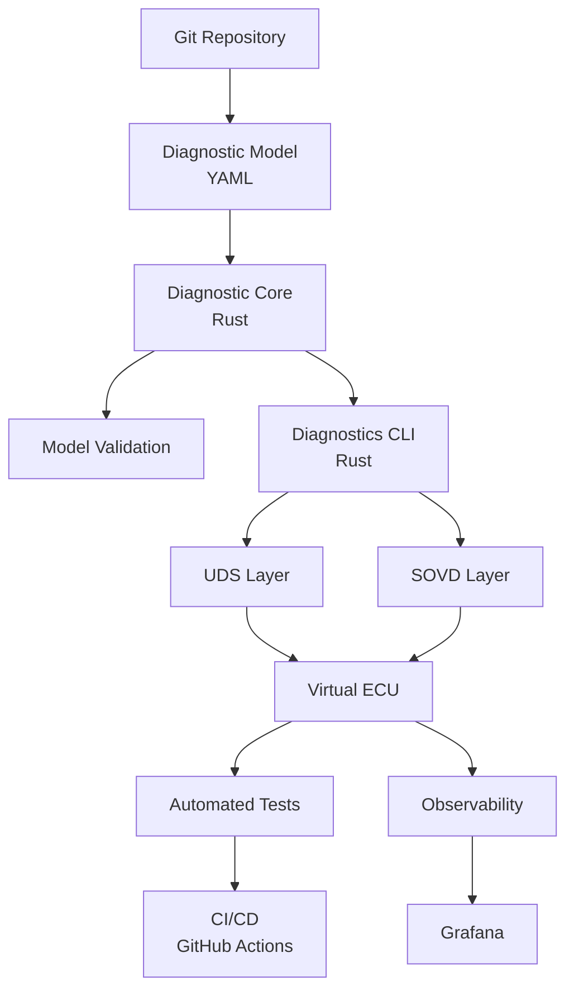

# Architecture Overview

## 1. Purpose

The Automotive Diagnostics as Code project is a model-driven diagnostic platform for experimenting with automotive diagnostic technologies including UDS and SOVD.

The system uses a version-controlled diagnostic model as its single source of truth.

The core implementation is written in Rust and organized as a Cargo workspace.

---

## 2. Core Architecture



---

## 3. Architectural Principle

The diagnostic model is the single source of truth.

The implementation should not independently redefine diagnostic information in the UDS, SOVD, Virtual ECU, and testing layers.

Instead:

```text
Diagnostic Model
       │
       ▼
Diagnostic Core
       │
 ┌─────┼──────┐
 ▼     ▼      ▼
UDS   SOVD   Tests
 │     │
 └──┬──┘
    ▼
Virtual ECU
```

This allows a diagnostic definition to be changed once and propagated consistently through the system.

---

## 4. Rust Core

Rust is the primary implementation language for the diagnostic platform.

The Rust implementation is organized as a Cargo workspace.

```text
crates/
├── diagnostic-core/
└── diagnostics-cli/
```

### Diagnostic Core

`diagnostic-core` contains the reusable domain logic:

* Diagnostic model structures
* YAML model loading
* Model validation
* Diagnostic identifiers
* Services
* Sessions
* DIDs
* DTCs
* Domain-level errors

The core must remain independent of the CLI and protocol-specific applications.

### Diagnostics CLI

`diagnostics-cli` provides the developer-facing command-line interface.

Planned commands include:

```text
diagnostics validate
diagnostics inspect
diagnostics generate
diagnostics virtual-ecu
```

The CLI consumes the diagnostic core instead of implementing diagnostic domain logic itself.

---

## 5. Protocol Layers

The diagnostic model is intentionally separated from protocol implementations.

The initial protocol layers are:

### UDS

Responsible for:

* UDS request handling
* UDS response generation
* Service dispatch
* Session handling
* DID operations
* DTC operations
* Protocol encoding and decoding

### SOVD

Responsible for:

* SOVD API exposure
* Diagnostic entity discovery
* Diagnostic information
* Diagnostic operations
* Mapping the diagnostic model to SOVD concepts

Both layers consume the same diagnostic core.

---

## 6. Virtual ECU

The Virtual ECU provides a hardware-independent execution environment for the diagnostic system.

Its purpose is to make the PoC reproducible without requiring a physical ECU.

The Virtual ECU will maintain state such as:

* Current diagnostic session
* ECU state
* DID values
* DTC state
* Reset state
* Diagnostic events

The Virtual ECU will later expose both UDS and SOVD interfaces.

---

## 7. Repository Structure

The planned repository structure is:

```text
automotive-diagnostics-as-code/
│
├── Cargo.toml
│
├── crates/
│   ├── diagnostic-core/
│   └── diagnostics-cli/
│
├── model/
│   ├── ecu.yaml
│   ├── services.yaml
│   ├── dids.yaml
│   └── dtcs.yaml
│
├── uds/
├── sovd/
├── virtual-ecu/
│
├── tests/
│
├── grafana/
│
├── docs/
│
└── .github/
    └── workflows/
```

Additional crates or applications may be introduced as the architecture evolves.

---

## 8. Separation of Concerns

The project follows these boundaries:

| Component         | Responsibility              |
| ----------------- | --------------------------- |
| YAML model        | Diagnostic configuration    |
| `diagnostic-core` | Domain model and validation |
| CLI               | Developer interaction       |
| UDS               | UDS protocol behavior       |
| SOVD              | SOVD API behavior           |
| Virtual ECU       | ECU simulation              |
| Tests             | Verification                |
| GitHub Actions    | Automation                  |
| Grafana           | Observability               |

No component should become the source of truth for information belonging to another component.

---

## 9. Existing Eclipse-Based Tooling

The PoC does not aim to replace existing automotive diagnostic tooling.

The existing Eclipse-based solution can remain part of the engineering workflow.

The long-term architecture allows diagnostic artifacts to be exchanged between the Rust-based model-driven platform and existing diagnostic tooling.

Potential future integration:

```text
Git
 │
 ▼
Diagnostic Model
 │
 ├──────────────► Rust Diagnostic Core
 │
 └──────────────► Eclipse-Based Tooling
```

The exact integration mechanism will be defined once the diagnostic model and required Eclipse interfaces are understood.

---

## 10. Technology Stack

| Area             | Technology                 |
| ---------------- | -------------------------- |
| Core language    | Rust                       |
| Build system     | Cargo                      |
| Workspace        | Cargo Workspace            |
| Diagnostic model | YAML                       |
| UDS              | Rust implementation        |
| SOVD             | Rust implementation        |
| Virtual ECU      | Rust                       |
| CLI              | Rust                       |
| Testing          | Rust + integration tooling |
| CI/CD            | GitHub Actions             |
| Containers       | Docker                     |
| Observability    | Grafana                    |
| Documentation    | Markdown + Mermaid         |
| Version control  | Git/GitHub                 |

The architecture remains CI-platform independent even though GitHub Actions is the initial CI implementation.

---

## 11. Design Goals

The architecture prioritizes:

* Single source of truth
* Strong typing
* Deterministic behavior
* Reproducible builds
* Automated validation
* Separation of domain and protocol logic
* Extensibility
* Testability
* CI/CD integration
* Hardware independence
* Future embedded applicability

Rust is used to provide a strong foundation for these goals while keeping the diagnostic domain independent from the transport layer.
