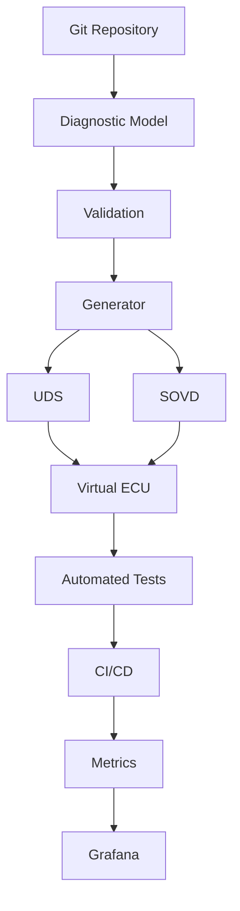

# Architecture Overview

## 1. Purpose

This document describes the high-level architecture of the Automotive Diagnostics as Code proof-of-concept.

The architecture is designed around a central principle:

> The diagnostic model is the source of truth for the diagnostic system.

Instead of maintaining diagnostic information independently across multiple tools and artifacts, the project aims to represent the core diagnostic definition in a version-controlled model.

## 2. High-Level Architecture



## 3. Main Components

### 3.1 Diagnostic Model

The diagnostic model contains the definition of the virtual ECU and its diagnostic capabilities.

It will eventually describe elements such as:

* ECU information
* Diagnostic sessions
* UDS services
* Data Identifiers
* Diagnostic Trouble Codes
* Diagnostic parameters

The model will be stored in a human-readable format and version-controlled with Git.

### 3.2 Validation

The validation layer verifies that the diagnostic model is structurally and semantically consistent before it is used by other components.

Examples include:

* Invalid service identifiers
* Duplicate DIDs
* Invalid DTC definitions
* Missing required fields
* Invalid parameter types

### 3.3 Generator

The generator consumes the diagnostic model and produces artifacts required by the different parts of the system.

The generator is intended to prevent duplicated definitions across the project.

### 3.4 UDS

The UDS layer provides diagnostic communication based on a selected subset of ISO 14229 services.

The implementation will initially focus on the services required by the PoC rather than attempting to implement the complete UDS specification.

### 3.5 SOVD

The SOVD layer provides a service-oriented diagnostic interface.

The same underlying diagnostic model should be usable by both the UDS and SOVD interfaces.

### 3.6 Virtual ECU

The Virtual ECU provides a software-based environment for executing the diagnostic functionality.

The purpose is to make the PoC reproducible without requiring physical automotive hardware.

### 3.7 Automated Tests

Tests verify the behavior of the diagnostic system.

Testing will eventually cover:

* Diagnostic model validation
* UDS behavior
* SOVD behavior
* Integration scenarios
* Error handling

### 3.8 CI/CD

GitHub Actions will automate the development workflow.

The planned pipeline is:

```text
Commit
  │
  ▼
Validate
  │
  ▼
Build
  │
  ▼
Test
  │
  ▼
Generate artifacts
  │
  ▼
Publish results
```

### 3.9 Grafana

Grafana will provide an observability layer for the PoC.

Potential metrics include:

* UDS requests
* UDS errors
* Diagnostic response time
* Active DTCs
* SOVD requests
* SOVD errors
* Test results
* CI/CD status

Grafana is not intended to be the source of diagnostic configuration.

The diagnostic model remains the source of truth.

## 4. Design Principles

### Single Source of Truth

Diagnostic definitions should not be duplicated unnecessarily.

### Version Control

Diagnostic changes should be traceable through Git history.

### Reproducibility

A developer should be able to clone the repository and reproduce the development environment.

### Automation

Validation, generation, testing, and documentation should progressively become automated.

### Separation of Concerns

The diagnostic model, diagnostic protocols, simulation, testing, CI/CD, and observability should remain separate components.

### Incremental Development

Each capability should be introduced through a documented milestone.

## 5. Relationship With Existing Automotive Tooling

The PoC does not aim to replace existing automotive diagnostic or Eclipse-based development environments.

Instead, it explores how Everything-as-Code principles can complement existing workflows.

Future iterations may investigate integration with Eclipse-based tooling and generated automotive artifacts.

## 6. Future Architecture

The architecture will evolve as the project develops.

Additional components may be introduced for:

* CAN
* DoIP
* ARXML
* Diagnostic description formats
* Eclipse integration
* Containerized development
* Hardware-in-the-loop testing
