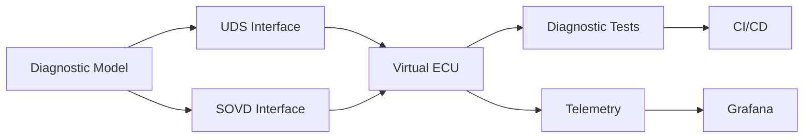

# Automotive Diagnostics as Code — Requirements

## 1. Purpose

This document defines the functional and technical requirements for the Automotive Diagnostics as Code proof-of-concept.

The requirements provide the baseline for the architecture, diagnostic model, implementation, testing, and future CI/CD integration.

The project is intentionally limited to a demonstrator scope and does not aim to provide a production-ready automotive diagnostic stack.

---

# 2. System Context

The PoC represents a simplified automotive Electronic Control Unit (ECU) with diagnostic capabilities.

The system shall provide two diagnostic access mechanisms:

1. UDS-based diagnostic communication
2. SOVD-based service-oriented diagnostic access

Both interfaces shall use the same underlying diagnostic definition.



---

# 3. Project Objectives

The PoC shall demonstrate that automotive diagnostic information can be maintained and managed using an Everything-as-Code approach.

The project objectives are:

* Define diagnostic information in a version-controlled model.
* Validate the diagnostic model automatically.
* Use the model as a source for diagnostic implementations.
* Provide a virtual ECU for reproducible testing.
* Implement a selected subset of UDS functionality.
* Provide a SOVD-based diagnostic interface.
* Automate diagnostic tests.
* Integrate validation and testing into CI/CD.
* Provide diagnostic observability through Grafana.
* Maintain architecture and technical documentation alongside the source code.

---

# 4. Scope

## 4.1 Included

The PoC will include:

* One virtual ECU
* ECU identification
* Diagnostic sessions
* ECU reset
* Read Data by Identifier
* Diagnostic Trouble Codes
* Clear Diagnostic Information
* UDS diagnostic communication
* SOVD diagnostic access
* Automated validation
* Automated testing
* GitHub Actions
* Grafana dashboards
* Version-controlled documentation

## 4.2 Excluded

The initial PoC will not attempt to implement:

* A complete UDS stack
* All ISO 14229 services
* A production SOVD implementation
* Functional safety certification
* Automotive cybersecurity certification
* Complete AUTOSAR diagnostic infrastructure
* Full vehicle networking
* Production ECU firmware
* Hardware-in-the-loop testing
* Real vehicle integration

These topics may be investigated in future iterations.

---

# 5. Functional Requirements

## FR-001 — ECU Definition

The system shall provide a machine-readable definition of the virtual ECU.

The definition shall include at least:

* ECU name
* ECU description
* Diagnostic address information

---

## FR-002 — Diagnostic Services

The diagnostic model shall support the definition of diagnostic services.

The initial PoC shall support:

* Diagnostic Session Control (`0x10`)
* ECU Reset (`0x11`)
* Clear Diagnostic Information (`0x14`)
* Read DTC Information (`0x19`)
* Read Data by Identifier (`0x22`)

Additional services may be introduced later.

---

## FR-003 — Diagnostic Sessions

The diagnostic model shall support diagnostic sessions.

The initial implementation shall consider:

* Default Session
* Extended Diagnostic Session

Programming Session may be introduced in a later milestone.

---

## FR-004 — Data Identifiers

The diagnostic model shall support Data Identifiers (DIDs).

Each DID shall provide, where applicable:

* Identifier
* Name
* Description
* Data type
* Data length
* Access information

The initial PoC shall contain a small representative set of DIDs.

---

## FR-005 — Diagnostic Trouble Codes

The diagnostic model shall support Diagnostic Trouble Codes.

Each DTC shall provide, where applicable:

* DTC code
* Description
* Severity
* Status information

The initial PoC shall contain several representative DTCs.

---

## FR-006 — Diagnostic Operations

The system shall provide mechanisms to:

* Read ECU information
* Read diagnostic data
* Read active diagnostic trouble codes
* Clear diagnostic information
* Change diagnostic sessions
* Reset the virtual ECU

---

## FR-007 — UDS Interface

The system shall provide a UDS diagnostic interface for the supported services.

The implementation shall provide:

* Diagnostic requests
* Positive responses
* Negative responses
* Session handling
* DID handling
* DTC handling

The transport mechanism shall initially be abstracted to keep the diagnostic logic independent from physical hardware.

---

## FR-008 — SOVD Interface

The system shall provide a SOVD-oriented interface for accessing diagnostic information.

The SOVD interface shall expose diagnostic information derived from the same diagnostic model used by the UDS implementation.

The interface should support, within the PoC scope:

* ECU/entity discovery
* Diagnostic information
* DTC information
* Diagnostic operations

---

## FR-009 — Virtual ECU

The project shall provide a software-based Virtual ECU.

The Virtual ECU shall:

* Maintain diagnostic state
* Process diagnostic requests
* Provide diagnostic responses
* Maintain DTC state
* Provide configurable diagnostic data

The Virtual ECU shall not require physical automotive hardware for the basic PoC.

---

## FR-010 — Model Validation

The diagnostic model shall be validated before being consumed by downstream components.

Validation shall detect, where applicable:

* Missing mandatory fields
* Invalid identifiers
* Duplicate identifiers
* Invalid data types
* Invalid service definitions
* Invalid DTC definitions

---

## FR-011 — Automated Testing

The project shall provide automated tests.

Testing shall progressively cover:

* Model validation
* UDS functionality
* SOVD functionality
* Virtual ECU behavior
* Integration scenarios

---

## FR-012 — CI/CD

The project shall provide an automated CI/CD workflow using GitHub Actions.

The pipeline shall progressively support:

```text
Validation
    ↓
Build
    ↓
Unit Tests
    ↓
Integration Tests
    ↓
Artifact Generation
```

---

## FR-013 — Observability

The system shall expose diagnostic and test information suitable for visualization.

Potential metrics shall include:

* Number of diagnostic requests
* Number of diagnostic errors
* UDS requests
* SOVD requests
* Diagnostic response time
* Active DTC count
* Test success rate

Grafana shall be used as the visualization layer.

---

# 6. Non-Functional Requirements

## NFR-001 — Reproducibility

A developer shall be able to reproduce the basic PoC environment from the repository.

---

## NFR-002 — Version Control

Diagnostic definitions, configuration, source code, tests, documentation, and CI/CD definitions shall be version-controlled.

---

## NFR-003 — Traceability

Changes to diagnostic definitions shall be traceable through Git history.

---

## NFR-004 — Maintainability

The architecture shall separate:

* Diagnostic model
* Validation
* Generation
* Diagnostic protocols
* Virtual ECU
* Tests
* CI/CD
* Observability

---

## NFR-005 — Extensibility

The architecture should allow additional diagnostic services, DIDs, DTCs, and interfaces to be introduced without restructuring the complete project.

---

## NFR-006 — Automation

Manual configuration should be minimized where automation can provide a reproducible alternative.

---

## NFR-007 — Documentation

Important architecture and implementation decisions shall be documented alongside the project.

---

# 7. Initial Diagnostic Scope

The initial diagnostic model shall contain a small representative ECU.

### ECU

```text
Name:
    DemoECU

Purpose:
    Automotive Diagnostics as Code demonstrator
```

### Services

| Service                      |    SID | Initial Scope |
| ---------------------------- | -----: | ------------- |
| Diagnostic Session Control   | `0x10` | Yes           |
| ECU Reset                    | `0x11` | Yes           |
| Clear Diagnostic Information | `0x14` | Yes           |
| Read DTC Information         | `0x19` | Yes           |
| Read Data by Identifier      | `0x22` | Yes           |

### Initial Sessions

| Session     |  Value |
| ----------- | -----: |
| Default     | `0x01` |
| Programming | `0x02` |
| Extended    | `0x03` |

Programming Session will initially be defined at the model level but does not need to be fully implemented in the first UDS iteration.

---

# 8. Initial DID Set

The first version should contain a small number of representative identifiers.

| DID      | Name                 | Type   |
| -------- | -------------------- | ------ |
| `0xF190` | VIN                  | String |
| `0xF187` | Spare Part Number    | String |
| `0xF18C` | ECU Serial Number    | String |
| `0xF191` | ECU Software Version | String |

The exact values and encoding rules will be defined when the diagnostic model is implemented.

---

# 9. Initial DTC Set

The first version should contain representative DTCs.

| DTC     | Description                 | Severity |
| ------- | --------------------------- | -------- |
| `P0300` | Random Misfire              | Warning  |
| `U0100` | Lost Communication With ECM | Critical |
| `U0121` | Lost Communication With ABS | Warning  |

The DTC model may evolve as the diagnostic implementation is developed.

---

# 10. Success Criteria

The PoC will be considered successful when a developer can:

1. Clone the repository.
2. Load the diagnostic model.
3. Validate the model automatically.
4. Start the Virtual ECU.
5. Send supported UDS requests.
6. Receive valid diagnostic responses.
7. Access equivalent diagnostic information through SOVD.
8. Execute automated tests.
9. Run the complete workflow through GitHub Actions.
10. Visualize relevant system information using Grafana.

The final demonstration should show that a change to the diagnostic model can propagate through the automated development workflow.

Example:

```text
Change diagnostic model
        ↓
Git commit
        ↓
Validation
        ↓
Generation
        ↓
Build
        ↓
Tests
        ↓
Virtual ECU
        ↓
SOVD / UDS
        ↓
Metrics
        ↓
Grafana
```

---

# 11. Traceability

Requirements shall progressively be connected to implementation and automated tests.

Example:

```text
FR-004
Data Identifiers
      │
      ├── Diagnostic Model
      │
      ├── UDS DID Handler
      │
      └── test_did_read.py
```

This traceability will become more detailed as the project develops.
    